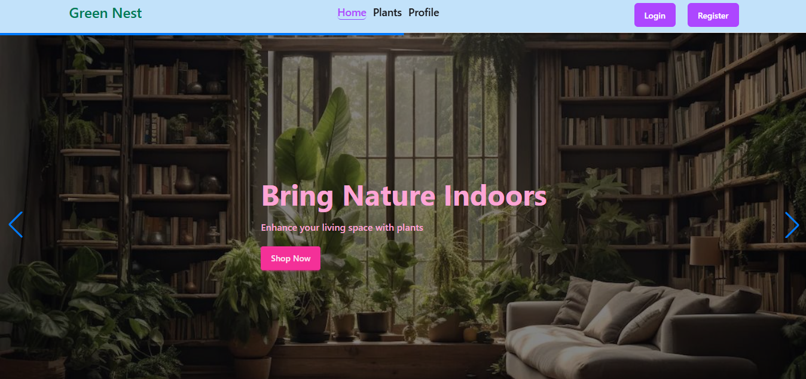

# 🌿 Green Nest

**Green Nest** is a modern plant-store web app built with **React 19**, **Vite**, **Firebase Auth**, and **Tailwind CSS 4**.  
It offers a smooth and responsive shopping experience for indoor-plant lovers — featuring authentication, dynamic plant listings, animated UI, and clean design.



## 🚀 Live Demo
- **[Netlify](https://green-nest-org.netlify.app/)**
- **[CloudFlare](https://green-nest-org.pages.dev/)**

## 🧩 Core Features
- 🔐 **Firebase Authentication** — secure sign-up, sign-in, and logout flow
- 🌱 **Dynamic Plant Catalog** — data fetched from `plants.json` (local dataset)
- ⭐ **Ratings & Categories** — sort or view top-rated and categorized plants
- 🪴 **Detailed Plant View** — each plant has name, category, rating, description, care level, and provider info
- ⚙️ **Context API** — global state for user, loading, and plant data
- 🌀 **Framer Motion Animations** — smooth component transitions and fade effects
- 🔁 **Swiper Slider Integration** — carousel for featured or weekly plants
- 🔔 **React Toastify** — instant visual feedback for actions (login, purchase, etc.)
- ⏳ **Loading States** — handled with React Spinners
- 📱 **Responsive UI** — optimized for all screen sizes

## 🛠️ Tech Stack
| Category          | Tools / Libraries                                      |
|-------------------|--------------------------------------------------------|
| Frontend          | React 19, Vite 4                                       |
| Styling           | Tailwind CSS 4                                         |
| Animations        | Framer Motion                                          |
| Routing           | React Router 7                                         |
| UI Enhancements   | React Icons, Swiper 12, React Toastify 11, React Spinners |
| Backend / Auth    | Firebase 12                                            |
| Hosting           | Netlify, CloudFlare                                    |

## 🧮 Data Source
The app uses a static dataset: [`plants.json`](/public/plants.json)  
Each object includes:
```json
{
  "plantId": 1,
  "plantName": "Snake Plant",
  "category": "Air Purifier",
  "price": 18,
  "rating": 4.8,
  "availableStock": 10,
  "careLevel": "Easy",
  "description": "Snake Plant, or Mother-in-Law’s Tongue, is a resilient indoor plant...",
  "image": "https://i.pinimg.com/1200x/3f/4f/9c/3f4f9ca9a5751853219f31d9bbe34d94.jpg",
  "providerName": "UrbanGreen Studio"
}
```
---

## 🔒 Authentication Flow

- Firebase Auth handles user registration and login
- Auth Context provides the current user globally
- Protected routes restrict access to certain pages
- React Toastify displays real-time login/signup feedback

## ⚡ Firebase Configuration (Important – Never commit real keys!)

 Use in your code like this:

```javascript
const firebaseConfig = {
  apiKey: import.meta.env.VITE_apiKey,
  authDomain: import.meta.env.VITE_authDomain,
  projectId: import.meta.env.VITE_projectId,
  storageBucket: import.meta.env.VITE_storageBucket,
  messagingSenderId: import.meta.env.VITE_messagingSenderId,
  appId: import.meta.env.VITE_appId,
};
```
---

## ⚡ How to Run Locally

1. **Clone the repository**

```bash
git clone https://github.com/RazulBR/REACT_ASSIGNMENT_B12A09.git
cd REACT_ASSIGNMENT_B12A09
```
---
### 2. Install dependencies

```bash
npm install
```
---
### 3. Create .env file with your Firebase config (see above section)


Create a `.env` file in the project root:

```env
VITE_apiKey=your-api-key-here
VITE_authDomain=your-project.firebaseapp.com
VITE_projectId=your-project-id
VITE_storageBucket=your-project.appspot.com
VITE_messagingSenderId=your-sender-id
VITE_appId=your-app-id
```

### 4. Start the development serve

```bash
npm run dev
```
---

### 5. Open in browser

```bash
Go to http://localhost:5173 (or the port shown in your terminal)
```
---

## 🧑‍💻 Author

**MD REAZUL HASAN**

[GitHub Profile](https://github.com/Reazul87)

---

## 📜 License

This project is licensed under the **MIT License** — free to use and modify.

---

> _“Green Nest brings nature closer — explore, learn, and grow your indoor garden with ease.”_ 🌿
